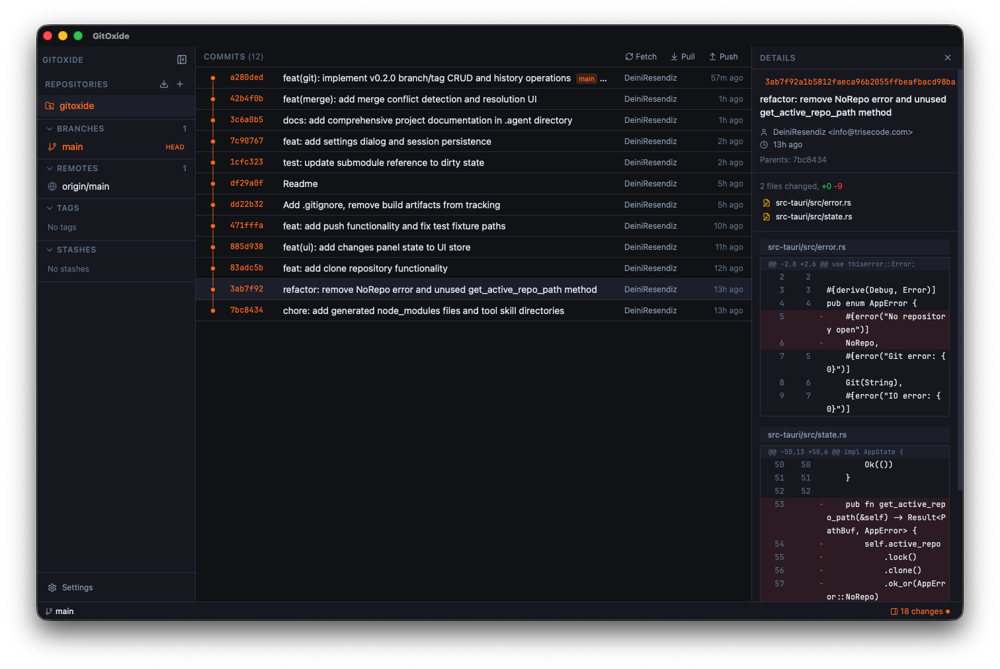

<p align="center">
  
</p>

<h1 align="center">GitFerrum</h1>

<p align="center">
  <strong>A high-performance, lightweight Git client built with Rust and Svelte.</strong>
</p>

<p align="center">
  <a href="#features">Features</a> &bull;
  <a href="#screenshots">Screenshots</a> &bull;
  <a href="#installation">Installation</a> &bull;
  <a href="#development">Development</a> &bull;
  <a href="#architecture">Architecture</a> &bull;
  <a href="#translations">Translations</a> &bull;
  <a href="#license">License</a>
</p>

---

GitFerrum is a native desktop Git client designed as a fast, minimal alternative to tools like GitKraken and SourceTree. It leverages [gitoxide](https://github.com/GitoxideLabs/gitoxide) (pure Rust) for ultra-fast Git reads and Tauri v2 for a tiny, secure native app.

## Screenshots

<p align="center">
  
</p>


## Features

- **Commit Graph Visualization** - SVG-based branch graph with color-coded lanes, merge curves, and infinite scroll
- **Multi-Repository** - Open, switch between, and close multiple repos from the sidebar
- **Changes Panel** - View staged, modified, and untracked files with one-click staging and inline commit
- **Smart Push** - Automatically detects when a branch has no upstream and offers to create it on the remote
- **Diff Viewer** - Unified diff view with syntax-colored additions/deletions and line numbers
- **Clone Repositories** - Clone from any URL directly from the app
- **Remote Branch Management** - Right-click context menu to create local branches, create with custom names, or browse in detached HEAD
- **Fetch / Pull / Push** - Toolbar buttons with badge indicators showing commits ahead/behind
- **File Watcher** - Automatic status refresh when files change externally (500ms debounce)
- **Multi-Language** - English, Spanish, and Portuguese with auto-detection
- **Keyboard Shortcuts** - `Cmd+O` open repo, `Cmd+Enter` commit, `Escape` close panels

## Tech Stack

| Layer | Technology |
|-------|-----------|
| **Framework** | [Tauri v2](https://v2.tauri.app/) |
| **Backend** | Rust, [gitoxide (gix)](https://github.com/GitoxideLabs/gitoxide), Tokio, Rayon |
| **Frontend** | [Svelte 5](https://svelte.dev/), TypeScript, [Tailwind CSS v4](https://tailwindcss.com/) |
| **Icons** | [Lucide](https://lucide.dev/) |
| **Build** | Vite 6 |
| **Tests** | Vitest (frontend), Cargo test (backend) |

## Installation

### Download

Download the latest release from the [Releases](../../releases) page:

- **macOS**: `.dmg` (Apple Silicon & Intel)
- **Windows**: `.msi` / `.exe`
- **Linux**: `.deb` / `.AppImage`

### Build from Source

**Prerequisites:**
- [Rust](https://rustup.rs/) (latest stable)
- [Node.js](https://nodejs.org/) 18+
- [Tauri CLI prerequisites](https://v2.tauri.app/start/prerequisites/)

```bash
git clone https://github.com/trisecode/gitferrum.git
cd gitferrum
npm install
npm run tauri build
```

The built app will be at `src-tauri/target/release/bundle/`.

## Development

```bash
# Install dependencies
npm install

# Run in development mode (hot reload)
npm run tauri dev

# Run tests
npm test                                    # Frontend (Vitest)
cd src-tauri && cargo test                  # Backend (Rust)

# Type checking
npm run check                               # Svelte
cd src-tauri && cargo check                 # Rust

# Production build
npm run tauri build
npm run tauri build -- --debug              # Debug build
```

### SSH Setup

GitFerrum uses your system's SSH configuration. Make sure your SSH key is loaded in the agent before pushing:

```bash
ssh-add ~/.ssh/your_key
```

## Architecture

```
gitferrum/
├── src/                          # Frontend (Svelte 5 + TypeScript)
│   ├── lib/
│   │   ├── components/           # 20+ Svelte components
│   │   │   ├── sidebar/          # Repo switcher, branches, remotes, tags
│   │   │   ├── graph/            # Commit graph, SVG lanes, commit rows
│   │   │   └── detail/           # Commit detail, file list, diff view
│   │   ├── stores/               # Reactive state (Svelte 5 runes)
│   │   ├── services/             # Tauri IPC wrappers
│   │   ├── i18n/                 # en, es, pt translations
│   │   └── utils/                # Graph layout, time formatting
│   └── App.svelte                # Root + keyboard shortcuts
│
├── src-tauri/                    # Backend (Rust)
│   └── src/
│       ├── commands.rs           # Tauri command handlers
│       ├── git/                  # Git operations
│       │   ├── graph.rs          # Commit graph + lane assignment algorithm
│       │   ├── diff.rs           # Unified diff parsing
│       │   ├── actions.rs        # Push, pull, fetch, commit, clone
│       │   ├── status.rs         # Working directory status
│       │   └── refs.rs           # Branches, tags, remotes (pure gitoxide)
│       ├── state.rs              # Multi-repo state management
│       └── watcher.rs            # File system watcher
│
└── tests/fixtures/               # Test repo with branches, merges, tags
```

### How It Works

- **Git reads** (graph, refs, history) use **gitoxide** — a pure Rust Git implementation for maximum speed
- **Git writes** (push, pull, commit, clone) shell out to **git CLI** for reliability and SSH compatibility
- **Frontend ↔ Backend** communication via Tauri's `invoke()` IPC with typed commands
- **Network operations** run in dedicated OS threads with 60-second timeouts
- **State** is managed with Svelte 5 runes (`$state`, `$derived`) in singleton stores
- **Multi-repo** support: each repo maintains independent state (graph, branches, status)

## Translations

GitFerrum supports 3 languages with automatic detection based on your system locale:

| Language | Code |
|----------|------|
| English | `en` |
| Español | `es` |
| Português | `pt` |

Translations live in `src/lib/i18n/`. To add a new language, create a new file following the pattern of `en.ts`.

## Testing

**45 automated tests** covering the core Git operations and frontend utilities:

```
Rust (25 tests):
  - git::graph     — commit graph, pagination, lane assignment, edges, refs
  - git::diff      — unified diff parsing, hunk headers, file status
  - git::refs      — branch/tag listing, HEAD detection, ref mapping
  - git::status    — working directory status, branch detection
  - git::actions   — stage, commit, checkout, stash

Frontend (20+ tests):
  - i18n           — all locales have same keys, plural/singular, functions
  - graph-layout   — lane colors, positions, constants
  - time           — relative time formatting per locale
  - types          — TypeScript interfaces match Rust structs
```

## Design

- **Color Palette**: Deep Night `#0f1117` background, Rust Orange `#f97316` accent, Slate `#e2e8f0` text
- **Typography**: Inter (UI) + JetBrains Mono (code/hashes)
- **Layout**: Three-pane — collapsible sidebar | commit graph | changes/detail panel
- **Graph**: Thin SVG lines with 8-color lane palette, Bezier curves for merges

## Contributing

Contributions are welcome! Please:

1. Fork the repository
2. Create a feature branch (`git checkout -b feature/my-feature`)
3. Commit your changes
4. Push to the branch
5. Open a Pull Request

## License

[GPL-3.0](LICENSE)

---

<p align="center">
  Built with Rust and Svelte by <a href="https://github.com/trisecode">Trisecode</a>
</p>
